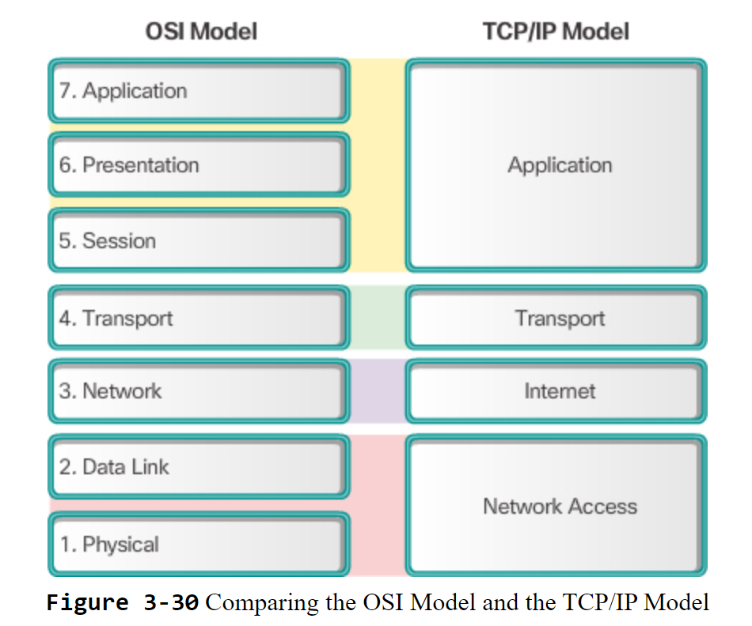

## Definitions And Terminologies

End devices connected to a network are called **Host**. They are either the source or destination of a message transmitted over the network. It is a _network node_ that is assigned a unique network address.

A **Server** is a computer/system running the software designed to provide services to other end devices on the network.

A **Client** is a computer/system with software installed that request or display the information obtained from the server.

> E.G Users access their emails (service) by using software on their end devices like Gmail or Outlook, which then communicates with the corresponding email server which provides such services.

A **Peer-To-Peer** Network is a network of interconnected computers/systems (peers) sharing resources directly with one another without relying on a central server.

> BitTorrent is a P2P network that provides file sharing services. Each computer/system in this network acts as both downloader (client) and uploader (server). Meaning each computer/system is simultaneously downloading chunks of the file and uploading chunks of it for peers in the network.

**Intermidiary Network Devices** help connect *hosts with networks* OR individual networks together forming an *internetwork*

> Examples of Intermdiary Network devices include - Routers, wireless access point, firewall appliances etc.

A **Network Interface Media (NIC)** is a circuit board installed in an end device enabling them to connect to a network via a *network media*. The network media is the wired/wireless path that data travels over from source to destination.

# LAN VS. WAN

A **Local Area Network** is a network that links network devices within a small localized area such as a home, office building or campus. It is typically owned and maintained by an individual or organization.

A **Wide Area Network** is a network that spans over a large geographical area such as cities, countries or continents. It connects small networks such as LANs to form a WAN. it is typically owned and maintained by telecommunication companies or Internet Service Providers.

## Comparing LAN. & WAN.

|Features | LAN | WAN |
|---------|-----|-----|
|Size of Interconnection| Interconnect end devices in limited areas | Interconnect LANs over wide geographical areas
|Administer| Single Organization/Individual| Multiple service providers|
|Speed|High-speed bandwidth btw End and Intermediary devices|Slower-speed links btw LANs|
---

## Rules of Communication

All communications have these 3 elemements;
1. Message Source / Sender
2. Destination / Receiver
3. Pathway - Channel where message travels from source to destination

When 2 devices communicate, both must follow the same rules governing the communication (**Protocols**).

Commmon communication protocols meet these requirements:
* Message Encoding
* Message Formatting and Encapsulation
* Message Size
* Message Timing
* Message Delivery Options

### Message Encoding
This involves converting (encoding) the message into an acceptable form of transmission, and then decoding the transmission to interpret the information.

### Message Formatting and Encapsulation
There is a specified format for messages between the source and destination.

The type of format will depend on the type of message and channel used to transmit the data.

The data is then encapsulated with additional information into a specific format called a **frame**. This frame is then sent over the network.

The data is then de-capsulated which is the reverse of Encapsulation to process the original data.

### Message Delivery Options
1. *Unicast*: one-to-one delivery option. Single destination for delivery.
2. *Multicast*: one-to-many delivery option. Target group of host receive message simultaneously.
3. *Broadcast*: one-to-all delivery option. All host in network recei message simultaneously.

### Network Protocols 
For successful network communication, computer and network protocols must interact and work together. 

A group of inter-reated protocols working together to provide a network communication function is called a **protocol suite**.

A protocol suite can be visualised to be a stack of layered protocols.

Layers interacting with each other would be considered protocol interaction. Higher level services depend on the functionality defined by protocols in lower layers. Lower layers are concerned with moving data over the network and providing services to higher levels while higher layers are concerned with the content of the message sent.

### The TCP/IP Protocol Suite
The TCP/IP protocol suite is a set of network protocols that allows for successful communication between any devices over the internet or other networks. 

The TCP/IP protocol suite is a set of interworking network protocols oranized into layers, with each layer containing real practical protocols (tools) enabling successful communication across networks. These protocols are based on the conceptual framework of the TCP/IP model (also referred to as the *internet model*), which provides an understanding of the purpose and function of each layer. The model includes;

|TCP/IP Model|
|------------|
|Application Layer|
|Transport Layer|
|Internet Layer|
|Network Access layer|

The Transmission Control Protocol/Internet Protocol (TCP/IP) protocol suite is an *open standard* meaning vendors can freely implement these protocols in their own hardware/software. It also ensures that products based on these protocols can interoperate successfully.

#### TCP/IP Communication Process
The process of a web server transmitting data to a web client is as follows:

1) Web server prepares the Hypertext Markup language (HTML) page as *user data* to be sent.
2) Reaching the Application Layer, the *application protocol HTTP header* is added to the front of the HTML data.

(HTTP Header) (Data) [**HTTP Data**]

3) The HTTP application layer protocol delivers the HTML web page data to the Transport Layer.
4) At the Transport Layer, the TCP Protocol adds a TCP header to the HTTP data to form the TCP segment. The function of the transport layer protocol is to *support communication* between devices, in this case the web server and web client. Next the TCP protocol delivers the TCP segment to the Internet layer

(TCP Header) (HTTP Header) (Data) [**TCP Segment**]

5) At the Internet Layer, the IP Protocol adds an IP Header to the TCP segment to form the IP packet. The IP protocol assigns appropriate source and destination IP addresses and places these information in the IP Header. The IP Protocol then delivers the IP packet to the Network Access layer.

(IP Header) (TCP Header) (HTTP Header) (Data) [**IP Packet**]

6) At the Network Access Layer, the Ethernet protocol adds an Ethernet header and Ethernet trailer to the IP Packet forming the *Ethernet Frame*. This Ethernet Frame which consists of a series of binary bits is transmitted across the internetwork to the web client. 

(Ethernet Header) (IP Header) (TCP Header) (HTTP Header) (Data) (Ethernet Trailer) [**Ethernet Frame**]

As we can see, as the data moves down from the Application Layer to the Network Access Layer, Encapsulation takes place at each layer as headers are added. 

7) At the Network Access Layer, the web client receives the Ethernet Frame in binary form. To access the user data / HTML web page, a de-capsulation is performed at each layer in reverse order as it moves from the Network Access layer to the Application Layer. 

The Ethernet header and trailer is processed and removed, then the IP header, TCP Header and finally the HTTP Header. 

Finally the web page information is passed on to the web client's web browser software.

### Reference Models

A reference model is a conceptual framework for understanding realtionships between various protocols (i.e TCP/IP Model)

Another example would be the Open Systems Interconnection (OSI) Model.

Why would we use a Layered Reference Model?
1. **Easier Standardization**: knowing each layer focuses on specific functions makes development easier
2. **Lower Dependence**: changes in one layer does not affect others. This allows for protocols and functions in each layer to be independently developed.
3. **Ensures Interoperability**: Products from different vendors can work together.
4. **Ease Of Understanding**: layering protocols and functions makes it clear for people to study and research networks (like us!)

#### OSI Model
The OSI model has 7 layers, each has its function and services and interact with layers *directly* above and below.

|OSI Model||
|----|-----|
|Layer 7|Application|
|Layer 6|Presentation|
|Layer 5|Session|
|Layer 4|Transport|
|Layer 3|Network|
|Layer 2|Data Link|
|Layer 1|Physical|

#### TCP/IP Model
|Layer|Function|
|----|-------|
|Application|Represent data to users, perform encoding and dialog control. Users typically interact with application program to get work done|
|Transport|Controls flow of information between application program running the *client* and application program running the *server*|
|Internet|Determine best path for network|
|Network Access|Controls hardware devices and media making up the network|
---

#### OSI & TCP/IP Model Comparison

**Similarities:**
1. The OSI Layer 3 (network layer) maps directly to the TCP/IP Internet layer. Both layers are used to describe protocols that address and route messages through an internetwork.
2. The OSI Layer 4 (transport layer) maps dierectly to the TCP/IP Tranport layer. Both layers describe general services and functions that provide ordered and reliable delivery of data between sources and destination hosts.

**Differences**
1. OSI model has 7 layers, TCP/IP model has 4 layers
2. OSI seperates layers 1 and 2 for specific roles. The Data Link layer defines procedures to access the medium while the Physical layer specifies the hardware-level communication. TCP/IP does not specify.
3. The TCP/IP model application layer includes protocols to provide specific functionality for a variety of end user applications. The OSI model layers 5,6 and 7 provide reference for application software developers and vendors to produce products operating on the network.

## Data Transfer

### Data Encapsulation
In order for data to be transmitted successfully across the network, it needs to be *encapsulated with the sufficient addressing and control information* for it to move from source to destination. The type of information will depend on whether the destination is in a local or remote network.

### Message Segmentation
Message can be delivered more efficiently from source to destination by dividing it into smaller manageable pieces (segmentation) Each segment goes through the same process to reach the destination. When all the pieces arrive at the destination, it is reassembled into the original message.

### Addressing
For successful data transmission, data must be encapsulated with the correct source and destination addresses.

There is a hardware address in every Network Interface Card (NIC). It is a unique Media Access Control (MAC) address which is 48 bits/6 bytes in length.

There are also 2 types of addresses with different purposes needed for transmission of data over a network.

1. **Network / Layer 3 Addresses**: or *end-to-end* addresses, the **network layer** source and destination addresses are responsible for delivering packet from the original source to the end destination, either on the same link or remote network.

2. **Data Link / Layer 2 Addresses**: or *point-to-point* addresses, the **data link layer** source and destination addresses are responsible for delivering data link frame from one NIC to another NIC on the same network.

#### Data Link Addressing (Same Network Vs. Different Network)
For devices on the **same network**;
Source Address - data link address of the device initiating transmission
Destination Address - data link address of target device destined to receive transmission

This works the same way on both L2 addresses and L3 addresses

For devices on **different network**;

